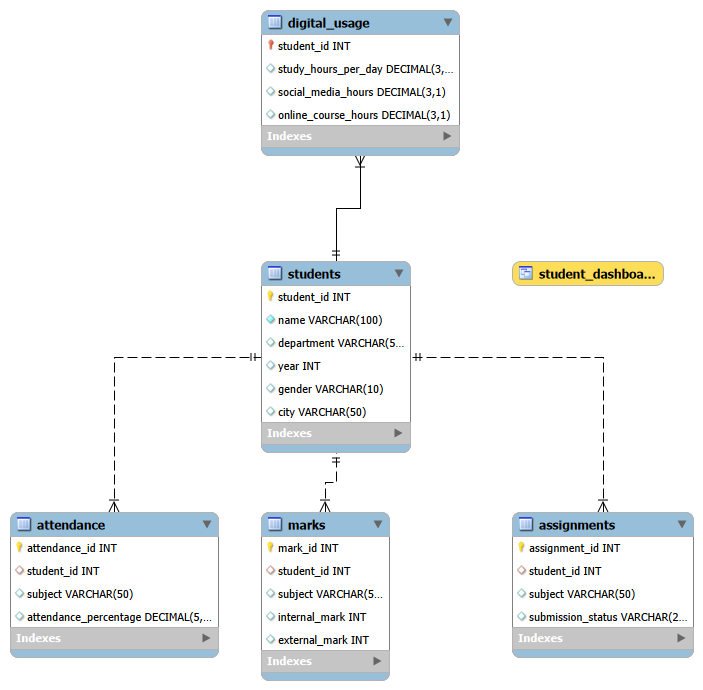
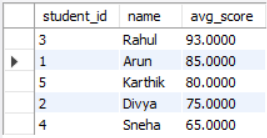
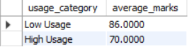

📊 Student Digital Behavior & Academic Performance Analysis

📌 Project Overview

This project explores the relationship between students' digital behavior (study hours, social media usage, online course engagement) and their academic performance using SQL.The goal was to design a relational database system and perform analytical queries to extract meaningful insights that can help educational institutions identify performance trends and at-risk students.This project demonstrates strong SQL fundamentals combined with analytical thinking.

🛠️ Technologies Used

       SQL (MySQL)
       MySQL Workbench
       Relational Database Design
       Analytical Querying

🗂️ Database Structure

The project consists of the following tables:
         Students – Student demographic details
         Attendance – Attendance percentage per subject
         Marks – Internal and external marks
         Assignments – Submission behavior
         Digital_Usage – Study hours, social media usage, online learning time
         Relationships were created using foreign keys to maintain data integrity.

The ER diagram below represents the schema design:

 

📈 Key Analyses Performed
    🔹 Average Performance Per Student
            Calculated using aggregation and grouping to evaluate overall academic strength.
             
    🔹 Social Media Usage vs Academic Performance
            Used CASE statements and grouping to categorize high vs low usage students and measure impact on performance.
            
    🔹 At-Risk Student Identification
            Identified students with:
                    Low attendance
                    Low academic scores       
    🔹 Department-Wise Ranking 
            Used window functions (RANK, ROW_NUMBER) to rank students within each department.        
    🔹 Performance Categorization
         Classified students into: 
           Excellent
           Good
           Average
           Needs Improvement   
    🔹 KPI Summary Metrics
         Created summary metrics including: 
          Total students
          Overall average marks    
           

🧠 SQL Concepts Covered

        1. SELECT, WHERE        
        2. GROUP BY, HAVING        
        3. INNER JOIN        
        4. CASE statements        
        5. Aggregate functions        
        6. Subqueries        
        7. CTE (WITH clause)        
        8. Window functions (RANK, ROW_NUMBER)        
        9. Views        
        10. Indexing

🎯 Business Insights Derived
      
      Higher social media usage showed correlation with slightly lower academic performance.
      Students with low attendance were more likely to underperform.
      Assignment submission behavior directly impacted overall marks.
      Department-level analysis revealed performance variations across disciplines.

🚀 Project Highlights

    ✔ Designed normalized relational database
    ✔ Implemented multi-table joins
    ✔ Applied advanced SQL analytical functions
    ✔ Generated actionable insights from structured data
    ✔ Built BI-ready views for dashboard integration

📂 How to Run This Project

      1. Open MySQL Workbench.
      2. Execute database_schema.sql
      3. Execute sample_data.sql
      4. Execute analysis_queries.sql
      5. Run analytical queries to generate insights

👩‍💻 Author

Dharanisri Subramaniam
Aspiring Data Analyst
Focused on SQL, Data Analysis & Business Insights
